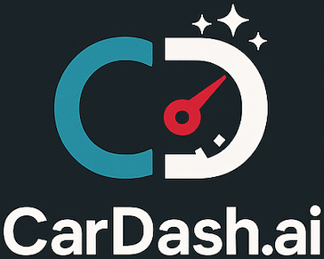
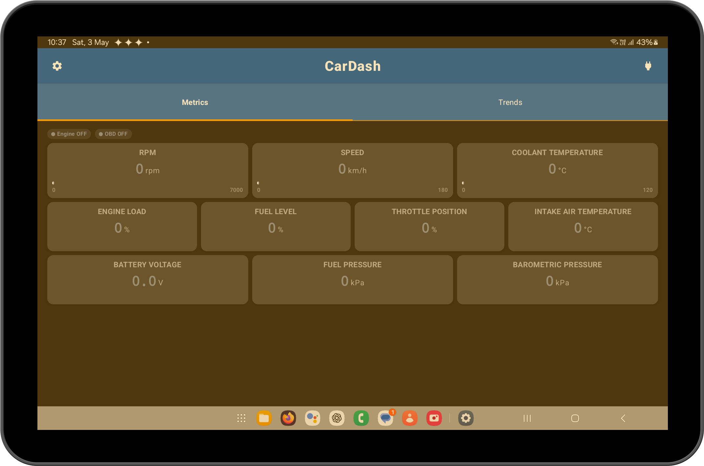
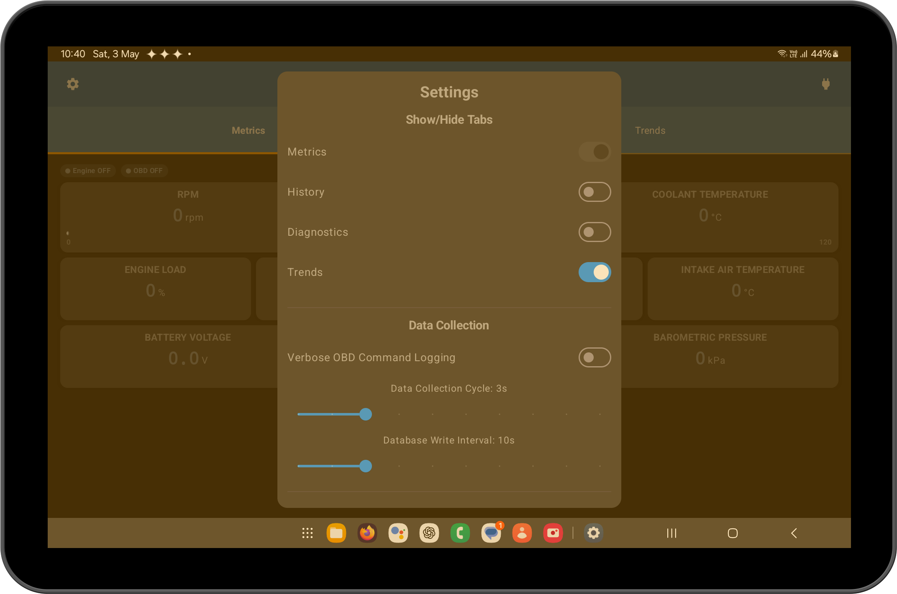

# CarDash

<div align="center">



### Your Vehicle's Digital Dashboard & Diagnostics Companion

[](LICENSE)
[](https://www.android.com/)
[](https://kotlinlang.org/)
[](https://developer.android.com/jetpack/compose)
  
</div>

## 🚗 About CarDash

CarDash transforms your Android device into a powerful automotive dashboard, connecting to your vehicle's OBD-II port to provide real-time metrics and basic diagnostics. Whether you're a car enthusiast wanting to monitor your engine's vital statistics or a DIY mechanic diagnosing issues, CarDash offers an intuitive interface for viewing your vehicle's data.

## 🔒 Privacy First

CarDash is built with privacy as a core principle:

* **No Account Required** - Use the app without creating any account or signing up
* **No Data Collection** - We don't track, collect, or transmit your vehicle data
* **No Analytics** - No usage tracking or analytics frameworks
* **No Advertisements** - Zero ads or third-party tracking
* **100% Local Storage** - All your data stays on your device
* **No Internet Required** - Works completely offline after installation

Your vehicle data belongs to you alone. Period.

<div align="center">

|Real-time Metrics Dashboard|Settings & Configuration|
|:-------------------------:|:----------------------:|
|||

</div>

## ✨ Key Features

### 📊 Comprehensive Metrics Dashboard
* **Real-time Engine Stats**: RPM, speed, engine load, and throttle position
* **Temperature Monitoring**: Coolant and intake air temperature
* **System Status**: Fuel level, fuel pressure, barometric pressure, and battery voltage
* **Customizable Layout**: Arrange metrics in your preferred dashboard configuration

### 📈 Data Visualization
* **Basic Graphs**: View trends of your vehicle's parameters
* **Historical Data**: See how metrics change over time

### 🔧 Basic Diagnostics
* **OBD-II Error Codes**: Read diagnostic trouble codes
* **Log Viewer**: View basic communication logs with your vehicle's ECU
* **Data Recording**: Save session data for later analysis

### 📱 Modern Android Experience
* **Material Design**: Clean, intuitive interface
* **Jetpack Compose UI**: Responsive layouts for various screen sizes
* **Tab-based Navigation**: Easy access to different functionality

## 🛠️ Requirements

* Android 8.0 (API level 26) or higher
* Bluetooth-enabled Android device
* OBD-II compatible vehicle (generally all cars made after 1996 in the US, 2001 in the EU, and 2008 globally)
* ELM327-based Bluetooth OBD-II adapter (widely available for $10-30)

## 🚀 Getting Started

1. **Connect your OBD-II adapter**
   * Plug the adapter into your vehicle's OBD-II port (typically under the dashboard)
   * Turn on vehicle ignition (engine doesn't need to be running)

2. **Pair with Bluetooth**
   * Pair your Android device with the OBD-II adapter in your Bluetooth settings
   * Default PIN is often `0000` or `1234`

3. **Launch CarDash**
   * Open the app and tap the connection button in the top right
   * Select your paired OBD-II adapter
   * Accept the requested permissions

4. **Start monitoring**
   * Once connected, your vehicle's metrics will appear on the dashboard
   * Customize your view using the settings menu

## 🔄 Current Status

### What's Working
✅ Bluetooth connection to most standard ELM327 OBD-II adapters  
✅ Real-time display of vehicle metrics with customizable dashboard  
✅ Basic graph visualization of metrics over time  
✅ Basic diagnostic logging and session history  
✅ Multiple tabs for different functionality (Metrics, Trends, Diagnostics, History)  
✅ Settings customization for tab visibility and data collection frequency  

### What's In Development
🔄 **Android Auto Integration** - View your vehicle metrics directly on your car's infotainment display  
🔄 **Gemini AI Integration** - Advanced diagnostics and predictive maintenance using Google's Gemini AI  
🔄 Enhanced diagnostic trouble code (DTC) interpretation  
🔄 Trip logging and analysis  
🔄 Fuel economy calculations  
🔄 Expanded vehicle compatibility testing  

### Known Limitations
⚠️ Fuel pressure readings may be unavailable on some vehicles  
⚠️ Battery voltage reading accuracy depends on OBD-II adapter quality  
⚠️ Not all metrics are supported by all vehicles (manufacturer dependent)  
⚠️ Performance may vary based on vehicle's OBD-II implementation  

## ### 🚗 Android Auto Integration Setup

For developers looking to work on or understand the Android Auto integration for CarDash, the following manifest configurations are crucial for the app to be recognized and run correctly on an Android Auto unit (including the Desktop Head Unit - DHU):

1.  **`AndroidManifest.xml` Core Components:**

    *   **Uses Library:** Declare that the app uses the `androidx.car.app` library. It's recommended to set `android:required="false"` to allow installation on devices without the Android Auto framework, which simplifies development and testing of the phone app components.
        ```xml
        <application ...>
            <uses-library android:name="androidx.car.app" android:required="false"/>
            ...
        </application>
        ```

    *   **Car App Service:** This service is the entry point for Android Auto.
        *   It must be exported.
        *   It needs an intent filter for the `androidx.car.app.CarAppService` action.
        *   It requires a category declaration (e.g., `androidx.car.app.category.IOT` for an Internet of Things type app, which suits CarDash).
        ```xml
        <service
            android:name=".services.auto.CarDashCarAppService"  
            android:exported="true"
            android:label="@string/app_name">
            <intent-filter>
                <action android:name="androidx.car.app.CarAppService" />
                <category android:name="androidx.car.app.category.IOT" />
            </intent-filter>
        </service>
        ```

    *   **Application-Level Meta-Data:**
        *   **Automotive App Description:** This links to an XML file (typically `res/xml/automotive_app_desc.xml`) that declares the app uses automotive templates.
            ```xml
            <application ...>
                ...
                <meta-data
                    android:name="com.google.android.gms.car.application"
                    android:resource="@xml/automotive_app_desc" />
                ...
            </application>
            ```
        *   **Minimum Car API Level:** This declares the minimum version of the Car App Library the app is compatible with.
            ```xml
            <application ...>
                ...
                <meta-data
                    android:name="androidx.car.app.minCarApiLevel"
                    android:value="1" />
                ...
            </application>
            ```

2.  **`res/xml/automotive_app_desc.xml`:**
    This file is referenced by the `com.google.android.gms.car.application` meta-data in the manifest. It must declare that the app uses templates.
    ```xml
    <?xml version="1.0" encoding="utf-8"?>
    <automotiveApp>
        <uses name="template" />
    </automotiveApp>
    ```

Ensuring these elements are correctly configured is the first step to getting your Android Auto app recognized by the system and appearing in the launcher on the head unit.

3.  **Enabling Developer Mode for Android Auto (On Phone):**
    To test your app, including on the Desktop Head Unit (DHU), you need to enable developer mode in the Android Auto application on your phone:
    *   Open the Android Auto app on your phone.
    *   Go to **Settings**.
    *   Scroll down to the **Version** number and tap it repeatedly (usually 7-10 times) until you see a toast message saying "Developer mode enabled" or a dialog asking to enable developer settings.
    *   Once enabled, you can access developer settings via the three-dot menu (⋮) in the top-right corner of the Android Auto settings screen. This is where you can enable "Unknown sources" to run development builds from Android Studio and start the Head Unit Server for DHU.

4.  **Testing with the Desktop Head Unit (DHU):**
    The DHU allows you to simulate an Android Auto head unit on your development machine.
    *   **Install DHU:** If you haven't already, download the DHU from the Android Studio SDK Manager. It's typically found under "SDK Tools" -> "Android Auto Desktop Head Unit emulator".
    *   **Enable Head Unit Server:** In the Android Auto app's developer settings on your phone (see step 3), enable "Start head unit server".
    *   **Connect Phone:** Connect your phone to your computer via USB.
    *   **Start DHU:**
        *   On **macOS/Linux**, navigate to `~/Library/Android/sdk/extras/google/auto/` (macOS) or `~/Android/Sdk/extras/google/auto/` (Linux) in your terminal and run `desktop-head-unit`.
        *   On **Windows**, navigate to `C:\Users\<YourUser>\AppData\Local\Android\Sdk\extras\google\auto\` in Command Prompt or PowerShell and run `desktop-head-unit.exe`.
    *   The DHU should launch and connect to your phone, allowing you to see and test your CarDash app as it would appear on a car screen.

## 📄 License

This project is licensed under the MIT License - see the [LICENSE](LICENSE) file for details.

## 🙏 Acknowledgements

* [ELM327 Documentation](https://www.elmelectronics.com/products/ecutool/obdic/) for protocol specifications
* [OBD-II PIDs Reference](https://en.wikipedia.org/wiki/OBD-II_PIDs) for parameter definitions
* Android Jetpack libraries for modern Android development

---

<div align="center">
  <i>CarDash is an independent project not affiliated with any automotive manufacturer.</i><br>
  <i>Use of this application is at your own risk and discretion.</i>
</div>
