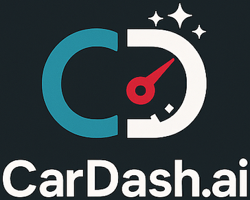
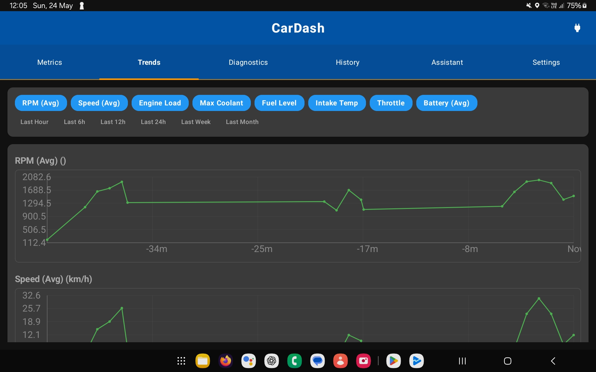
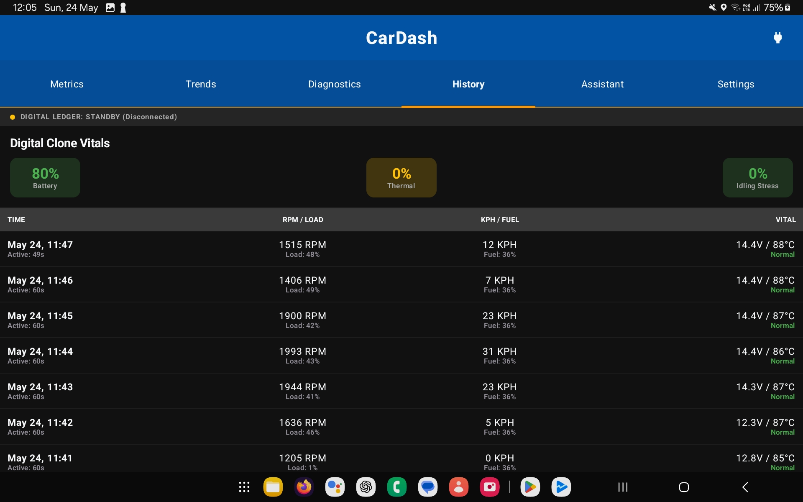
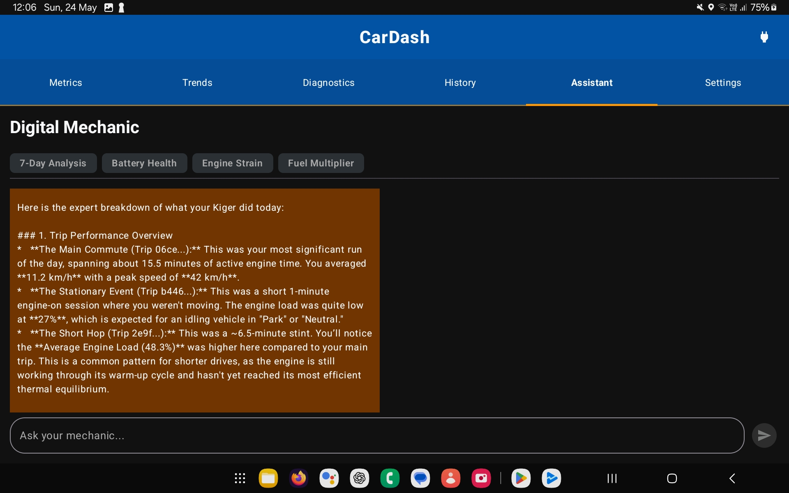
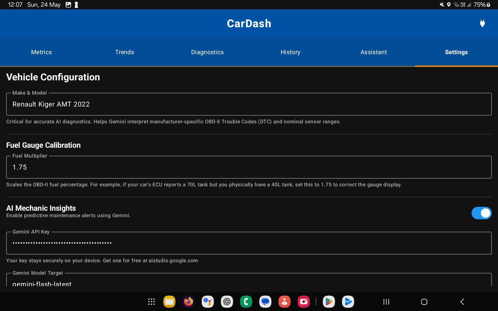

# CarDash

### Your Vehicle's Digital Dashboard & Diagnostics Companion

  

## 🚗 About CarDash

CarDash transforms your Android device into a powerful automotive dashboard, connecting to your vehicle's OBD-II port to provide real-time metrics and deep diagnostics. It maintains a persistent local ledger of your vehicle's health and employs Google Gemini as an on-demand virtual AI assistant.

## 🔒 Privacy First

CarDash is built with privacy as a core principle:

* **No Account Required** - Use the app without creating any account or signing up
* **No Data Collection** - We don't track, collect, or transmit your vehicle data
* **No Analytics** - No usage tracking or analytics frameworks
* **No Advertisements** - Zero ads or third-party tracking
* **100% Local Storage** - Your vehicle data stays on your device inside a local Room/SQLite database

Your vehicle data belongs to you alone. Period.

| 📈 Trend Graphs | 📋 History Table |
| :---: | :---: |
|  |  |

| 💬 AI Assistant | ⚙️ Settings |
| :---: | :---: |
|  |  |

## ✨ Key Features

### 📊 Comprehensive Metrics Dashboard
* **Real-time Engine Stats**: RPM, speed, engine load, and throttle position
* **Temperature Monitoring**: Coolant and intake air temperature
* **System Status**: Fuel level, fuel pressure, barometric pressure, and battery voltage
* **Android Auto Ready**: View key metrics securely on your vehicle's HUD while driving.

### 🧠 Gemini AI Assistant
* **Local Vehicle Ledger**: CarDash logs 1-minute heartbeats of your vehicle's vital signs (RPM, voltages, thermal limits).
* **Deterministic Analysis**: Fast, precise analytics via pre-computed logic (e.g., 7-day average strain, minimum voltage checks).
* **Agentic Chat**: Ask your assistant anything (e.g. "Did my engine overheat yesterday?"). The AI writes its own SQL queries to analyze your local database (built on Room/SQLite) securely.
* **Vehicle Context**: Save your car's Make and Model to get manufacturer-specific diagnostic advice.

### 📈 Data Visualization & Calibration
* **Advanced Trends**: Render beautiful graphs from your historical ledger using Compose Canvas.
* **Hardware Calibrations**: Supports overriding OBD-II generic data (e.g. correcting Renault/Nissan CMF-A+ 70L nominal fuel gauge discrepancies).

### 🔧 Basic Diagnostics
* **OBD-II Error Codes**: Read diagnostic trouble codes
* **Log Viewer**: View basic communication logs with your vehicle's ECU
* **Offline-First**: Only the AI Assistant explicitly requires an internet connection via the Gemini API token.

## 🛠️ Requirements

* Android 8.0 (API level 26) or higher
* Bluetooth-enabled Android device
* OBD-II compatible vehicle (generally all cars made after 1996 in the US, 2001 in the EU, and 2008 globally)
* ELM327-based Bluetooth OBD-II adapter (widely available for $10-30)

## 🚀 Getting Started

1. **Connect your OBD-II adapter**
   * Plug the adapter into your vehicle's OBD-II port (typically under the dashboard)
   * Turn on vehicle ignition (engine doesn't need to be running)

2. **Pair with Bluetooth**
   * Pair your Android device with the OBD-II adapter in your Bluetooth settings
   * Default PIN is often `0000` or `1234`

3. **Launch CarDash**
   * Open the app and tap the connection button in the top right
   * Select your paired OBD-II adapter
   * Accept the requested permissions

4. **Start monitoring**
   * Once connected, your vehicle's metrics will appear on the dashboard
   * Customize your view using the settings menu

## 📦 Download & Internal Testing

CarDash is available for internal testing via Google Play:

- **Join the internal test group:** [Join here](https://play.google.com/apps/internaltest/4700669721171506027)
- **Download the app:** [Direct Play Store link](https://play.google.com/apps/test/com.fuseforge.cardash/5)

> **Note:** You must join the internal test group before you can download or update the app from the Play Store. Using the Play Store is the most reliable way to ensure Android Auto visibility on modern devices.

## 🔄 Project Roadmap

### Recently Added (v2.3.3)
- ✅ **Local Vehicle Ledger**: Stabilized data flow with a central `VehicleState` cache and asynchronous SQLite `VehicleLedger`.
- ✅ **AI Agentic Queries**: LLM writes its own SQLite queries locally to answer complex historical diagnostic questions.
- ✅ **Renault/Nissan Fuel Calibration**: Resolved issues with CMF-A+ generic OBD percentages by introducing manual multi-factor calibration (e.g. 1.75 scaling factor).
- ✅ **Fuel Multiplier AI Chip**: Added a preset assistant quick-action chip to calculate fuel multiplier easily.
- ✅ **Graph & Axis Stabilization**: Resolved overlapping axis line rendering on trends graphs; added Y-axis sensor ranges and X-axis relative time markers.
- ✅ **Streamlined Model Selection**: Replaced free-text selection with a standardized model dropdown selection (`gemini-flash-lite-latest`, `gemini-flash-latest`, and `gemini-pro-latest`) and helpful descriptions in Settings.
- ✅ **OBD Reliability**: Fixed battery voltage returning zero by optimizing command queries (`AT RV`).

### Upcoming Frontiers
- 🔄 **BigQuery Data Lake**: Export the Digital Clone Ledger seamlessly to a personal Google Cloud BigQuery instance for deep analytics and long-term storage across devices.
- 🔄 Enhanced DTC (Error Code) interpretation using the Gemini model.
- 🔄 Background service worker for continuous low-power logging.

### Known Limitations
⚠️ Fuel pressure readings may be unavailable on some vehicles  
⚠️ Battery voltage reading accuracy depends on OBD-II adapter quality  
⚠️ **Android Auto UI is currently single-column only (list view); grid or two-column layouts are not yet supported**  

---

## 🛠️ Developer Resources

For details on manifest configuration, Desktop Head Unit (DHU) testing, and production signing, please refer to the [Developer Guide](DEVELOPER.md).

---

## 📄 License

This project is licensed under the MIT License - see the [LICENSE](LICENSE) file for details.

## 🙏 Acknowledgements

* [ELM327 Documentation](https://www.elmelectronics.com/products/ecutool/obdic/)
* [OBD-II PIDs Reference](https://en.wikipedia.org/wiki/OBD-II_PIDs)
* Android Jetpack libraries

  <i>CarDash is an independent project not affiliated with any automotive manufacturer.</i> 
  <i>Use of this application is at your own risk and discretion.</i>

