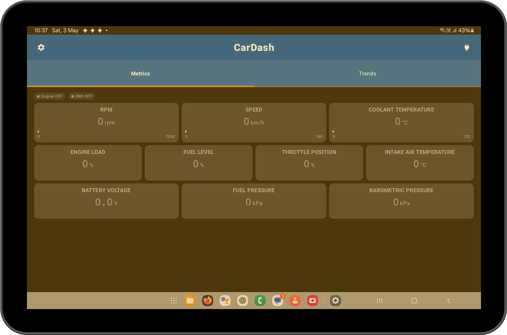
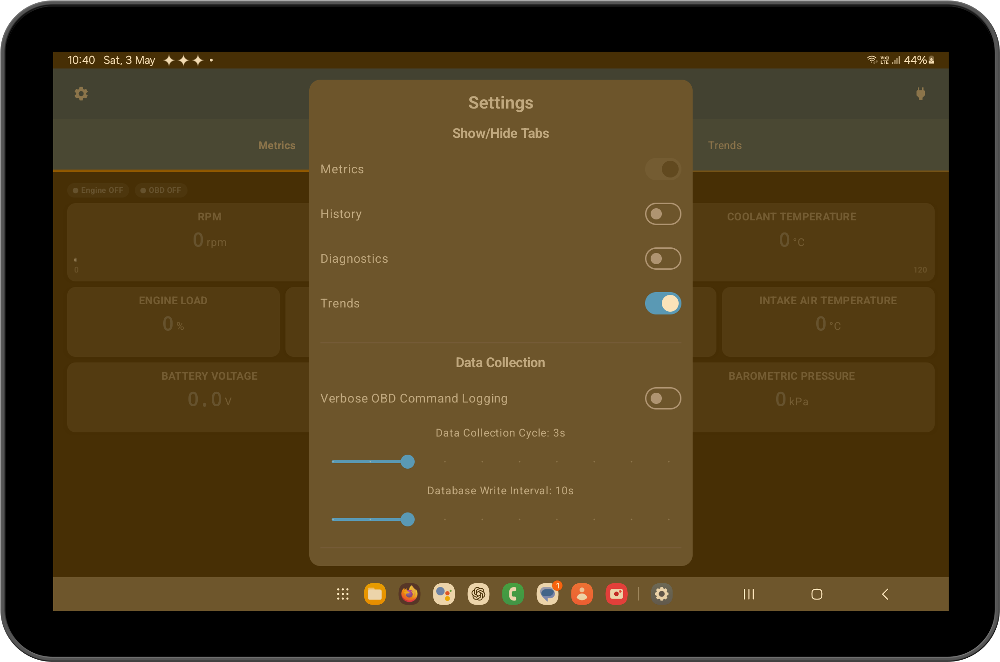

# CarDash

### Your Vehicle's Digital Dashboard & Diagnostics Companion

  

## 🚗 About CarDash

CarDash transforms your Android device into a powerful automotive dashboard, connecting to your vehicle's OBD-II port to provide real-time metrics and basic diagnostics. Whether you're a car enthusiast wanting to monitor your engine's vital statistics or a DIY mechanic diagnosing issues, CarDash offers an intuitive interface for viewing your vehicle's data.

## 🔒 Privacy First

CarDash is built with privacy as a core principle:

* **No Account Required** - Use the app without creating any account or signing up
* **No Data Collection** - We don't track, collect, or transmit your vehicle data
* **No Analytics** - No usage tracking or analytics frameworks
* **No Advertisements** - Zero ads or third-party tracking
* **100% Local Storage** - All your data stays on your device
* **No Internet Required** - Works completely offline after installation

Your vehicle data belongs to you alone. Period.

|Real-time Metrics Dashboard|Settings & Configuration|
|:-------------------------:|:----------------------:|
|||

## ✨ Key Features

### 📊 Comprehensive Metrics Dashboard
* **Real-time Engine Stats**: RPM, speed, engine load, and throttle position
* **Temperature Monitoring**: Coolant and intake air temperature
* **System Status**: Fuel level, fuel pressure, barometric pressure, and battery voltage
* **Customizable Layout**: Arrange metrics in your preferred dashboard configuration

### 🧠 AI Insights & Vehicle Profiles
* **Gemini AI Analysis**: Get real-time health insights based on your engine data.
* **Vehicle Context**: Save your car's Make and Model to help the AI provide manufacturer-specific diagnostic advice.
* **Explainable Diagnostics**: Visual cues for metric thresholds (Green/Yellow/Red).

### 📈 Data Visualization
* **Basic Graphs**: View trends of your vehicle's parameters
* **Historical Data**: See how metrics change over time

### 🔧 Basic Diagnostics
* **OBD-II Error Codes**: Read diagnostic trouble codes
* **Log Viewer**: View basic communication logs with your vehicle's ECU
* **Data Recording**: Save session data for later analysis

### 📱 Modern Android Experience
* **Material Design**: Clean, intuitive interface
* **Jetpack Compose UI**: Responsive layouts for various screen sizes
* **Tab-based Navigation**: Easy access to different functionality

## 🛠️ Requirements

* Android 8.0 (API level 26) or higher
* Bluetooth-enabled Android device
* OBD-II compatible vehicle (generally all cars made after 1996 in the US, 2001 in the EU, and 2008 globally)
* ELM327-based Bluetooth OBD-II adapter (widely available for $10-30)

## 🚀 Getting Started

1. **Connect your OBD-II adapter**
   * Plug the adapter into your vehicle's OBD-II port (typically under the dashboard)
   * Turn on vehicle ignition (engine doesn't need to be running)

2. **Pair with Bluetooth**
   * Pair your Android device with the OBD-II adapter in your Bluetooth settings
   * Default PIN is often `0000` or `1234`

3. **Launch CarDash**
   * Open the app and tap the connection button in the top right
   * Select your paired OBD-II adapter
   * Accept the requested permissions

4. **Start monitoring**
   * Once connected, your vehicle's metrics will appear on the dashboard
   * Customize your view using the settings menu

## 📦 Download & Internal Testing

CarDash is available for internal testing via Google Play:

- **Join the internal test group:** [Join here](https://play.google.com/apps/internaltest/4700669721171506027)
- **Download the app:** [Direct Play Store link](https://play.google.com/apps/test/com.fuseforge.cardash/5)

> **Note:** You must join the internal test group before you can download or update the app from the Play Store.

## 🔄 Project Roadmap

### Recently Added (v1.6.0)
- ✅ **Vehicle Profiles**: Manufacturer-specific context for smarter AI analysis.
- ✅ **Android Auto Integration**: View real-time metrics on your vehicle's HUD.
- ✅ **Gemini AI Diagnostics**: Advanced engine health insights.

### Core Features
- ✅ **Bluetooth OBD-II**: Seamless connection to standard ELM327 adapters.
- ✅ **Custom Dashboard**: Arrange 10+ vital vehicle metrics to your liking.
- ✅ **Historical Trends**: Graph visualization of engine data across trips.
- ✅ **Offline-First**: All data is stored locally with absolute privacy.

### Upcoming
- 🔄 Enhanced DTC (Error Code) interpretation.
- 🔄 Detailed trip logging and fuel economy analysis.
- 🔄 Expanded manufacturer-specific OBD-II PID support.

### Known Limitations
⚠️ Fuel pressure readings may be unavailable on some vehicles  
⚠️ Battery voltage reading accuracy depends on OBD-II adapter quality  
⚠️ Not all metrics are supported by all vehicles (manufacturer dependent)  
⚠️ Performance may vary based on vehicle's OBD-II implementation  
⚠️ **Android Auto UI is currently single-column only (list view); grid or two-column layouts are not yet supported**  

> **Note:** Android Auto UI may look different from the phone UI. See in-app for the latest appearance.

## � Download & Internal Testing

CarDash is available for internal testing via Google Play. Using the Play Store is the most reliable way to ensure Android Auto visibility on modern devices.

- **Join the test group:** [Join here](https://play.google.com/apps/internaltest/4700669721171506027)
- **Download the app:** [Direct Play Store link](https://play.google.com/apps/test/com.fuseforge.cardash/5)

---

## 🛠️ Developer Resources

For details on manifest configuration, Desktop Head Unit (DHU) testing, and production signing, please refer to the [Developer Guide](DEVELOPER.md).

---

## 📄 License

This project is licensed under the MIT License - see the [LICENSE](LICENSE) file for details.

## 🙏 Acknowledgements

* [ELM327 Documentation](https://www.elmelectronics.com/products/ecutool/obdic/)
* [OBD-II PIDs Reference](https://en.wikipedia.org/wiki/OBD-II_PIDs)
* Android Jetpack libraries

  <i>CarDash is an independent project not affiliated with any automotive manufacturer.</i> 
  <i>Use of this application is at your own risk and discretion.</i>

